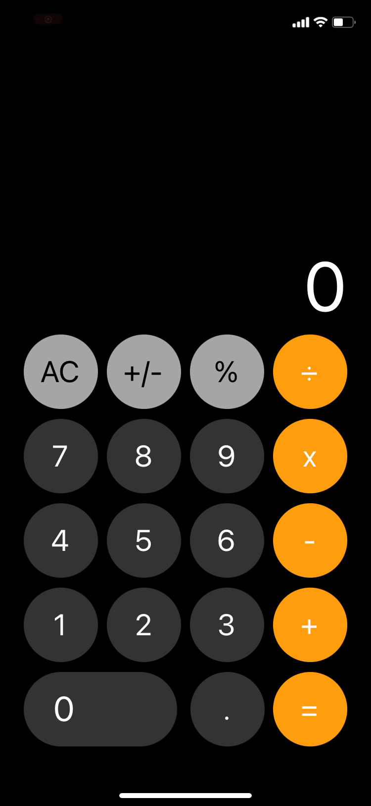

    ##   Hello World 👋 I´m Pedro , a Software Engineer Student

<h2 align="center">
 ⚡ PROJECT SHOWCASE
</h2>
  

  
  

  

 ⚠️ iOS Platform used only for illustration,
  

  

    application works on both Android and iOS devices.
  

  
   
   

## 🚀 Used Technologies

 

## 💬 Find me elsewhere

  
